# Histopathological Image Classification

This repository comprises my solution to a datachallenge organised at Telecom Paris at the end of a Machine Learning course, before delving deeper into Deep Learning. It contains :
* A [jupyter notebook](./Histopathological_Image_Classification.ipynb) detailing my classification algorithm and the choices taken to develop it
* A [presentation](./Restitution_Datachallenge.pdf) of the approach in PDF format, used to explain my reasoning to the whole promotion at the end of the challenge
* The [images](./data-challenge) used as dataset for the challenge

## Context of the project

The goal of the project was to classify breast cancer histopathological images into 8 different classes, each identified by different letters in the image filename. An overview of the different classes involved is given in the table below :
<table>
  <thead>
    <tr>
      <th align="center">Class ID</th>
      <th align="center">Identifying letters</th>
      <th align="center">Tumor full name</th>
      <th colspan="3" align="center">Images sample</th>
    </tr>
  </thead>
  <tbody>
    <tr>
      <td align="center">1</td>
      <td align="center">F</td>
      <td align="center">Fibroadenoma (benign)</td>
      <td align="center">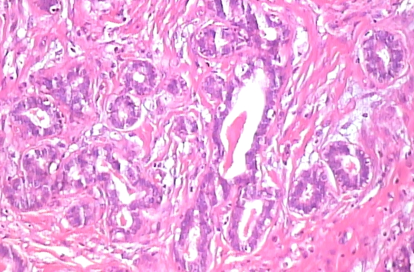</td>
      <td align="center">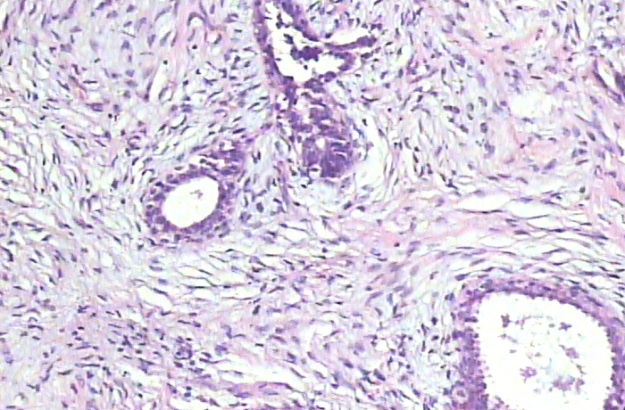</td>
      <td align="center">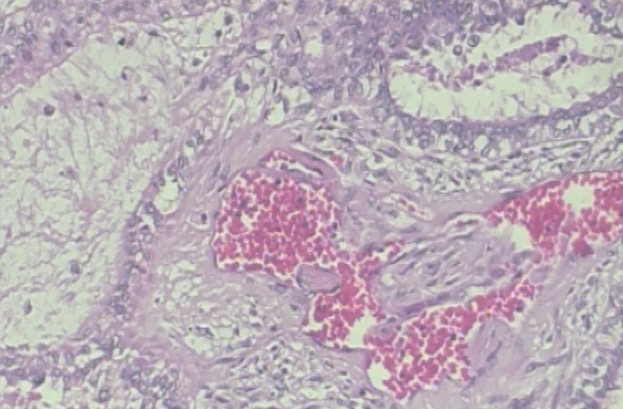</td>
    </tr>
    <tr>
      <td align="center">2</td>
      <td align="center">DC</td>
      <td align="center">Carcinoma (malignant)</td>
      <td align="center">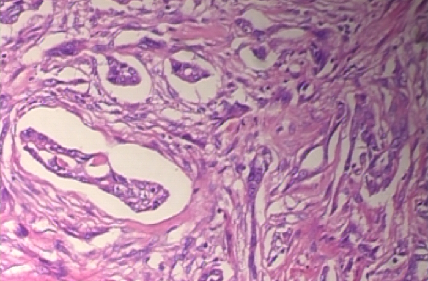</td>
      <td align="center">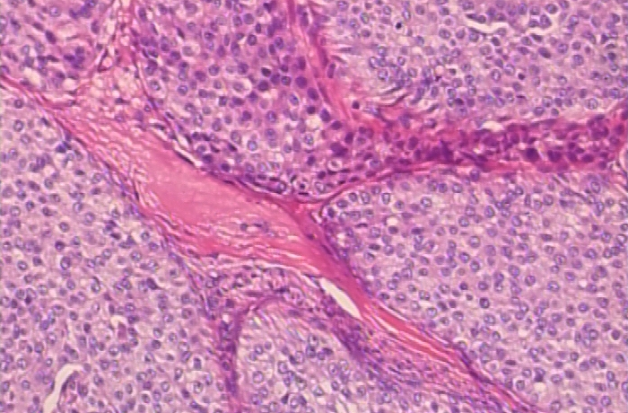</td>
      <td align="center">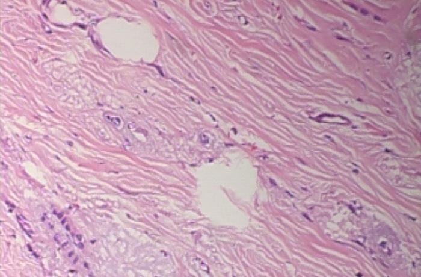</td>
    </tr>
    <tr>
      <td align="center">3</td>
      <td align="center">PC</td>
      <td align="center">Papillary Carcinoma (malignant)</td>
      <td align="center">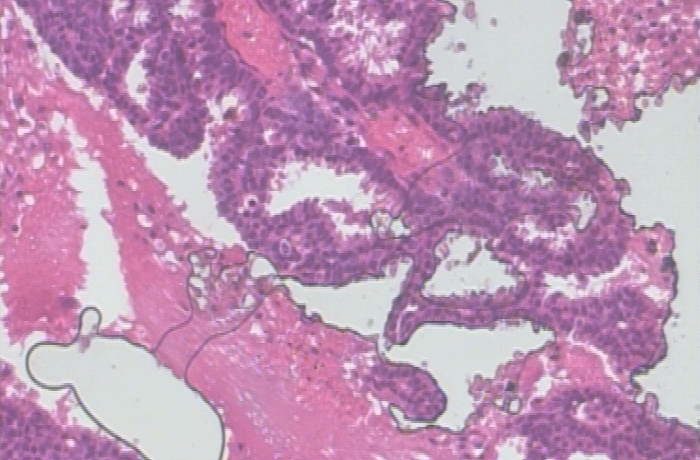</td>
      <td align="center">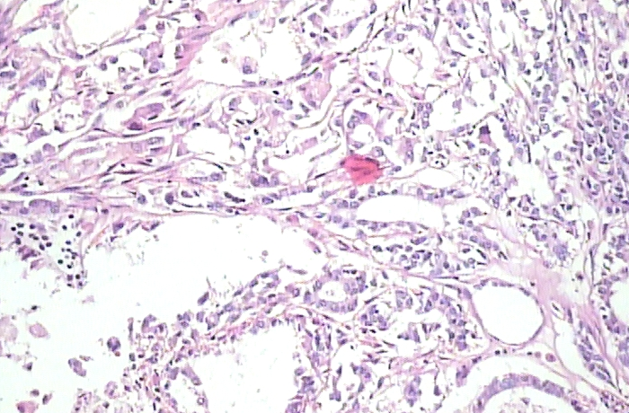</td>
      <td align="center">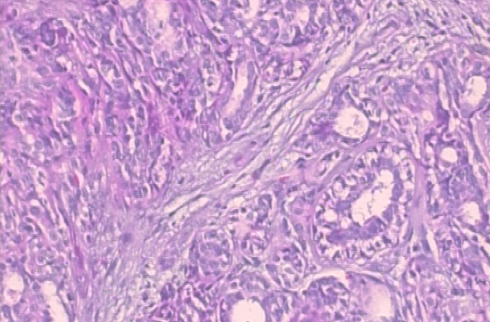</td>
    </tr>
    <tr>
      <td align="center">4</td>
      <td align="center">PT</td>
      <td align="center">Phyllodes Tumor (benign)</td>
      <td align="center">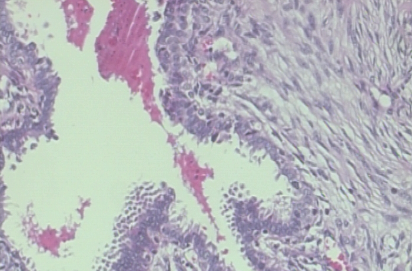</td>
      <td align="center">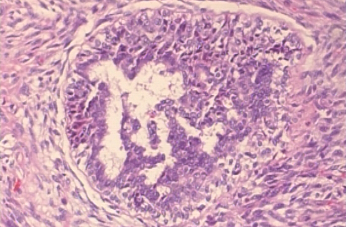</td>
      <td align="center">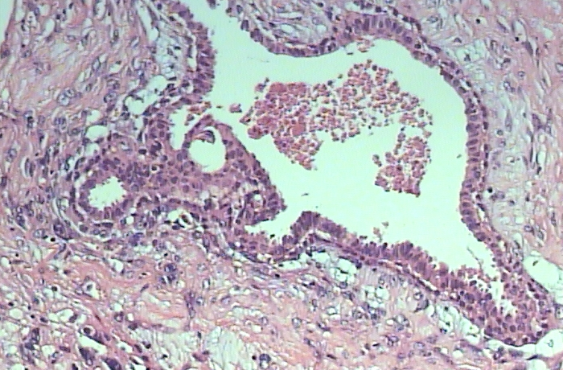</td>
    </tr>
    <tr>
      <td align="center">5</td>
      <td align="center">MC</td>
      <td align="center">Mucinous Carcinoma (malignant)</td>
      <td align="center">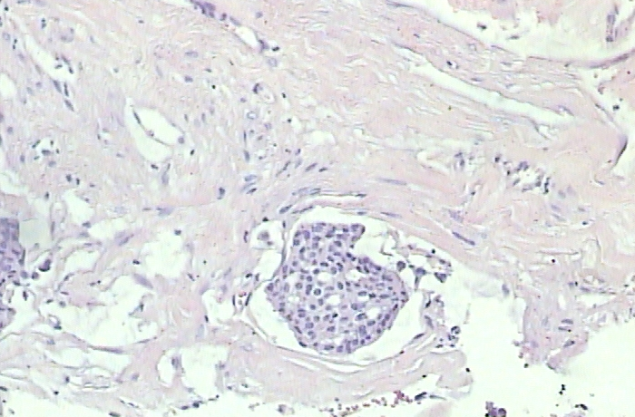</td>
      <td align="center">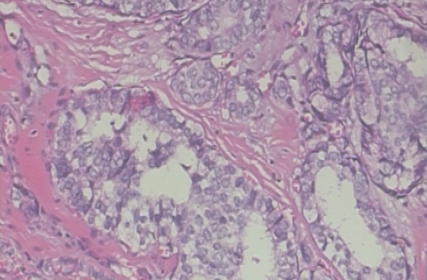</td>
      <td align="center">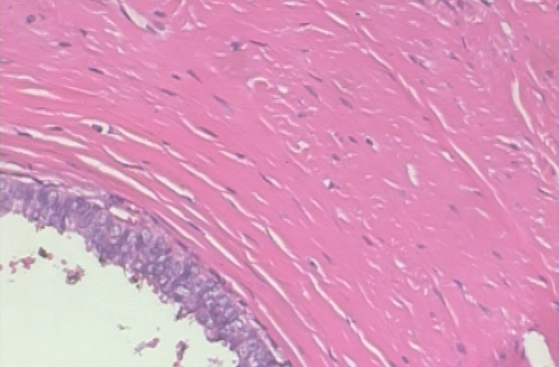</td>
    </tr>
    <tr>
      <td align="center">6</td>
      <td align="center">LC</td>
      <td align="center">Lobular Carcinoma (malignant)</td>
      <td align="center">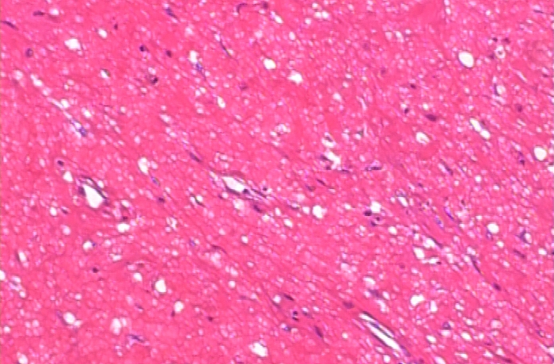</td>
      <td align="center">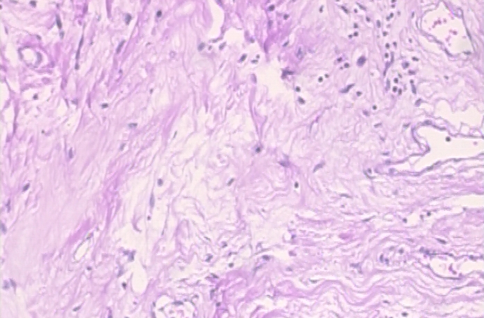</td>
      <td align="center">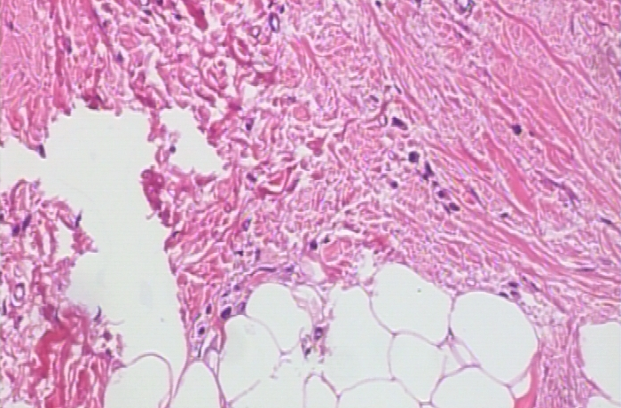</td>
    </tr>
    <tr>
      <td align="center">7</td>
      <td align="center">A</td>
      <td align="center">Adenosis (benign)</td>
      <td align="center">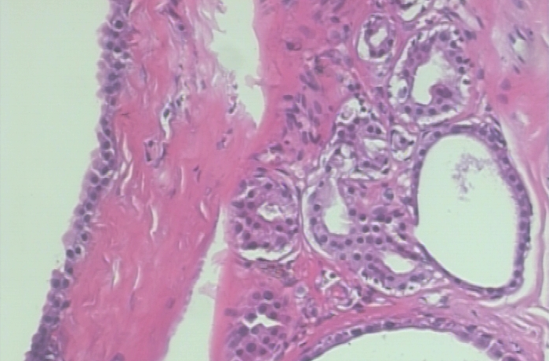</td>
      <td align="center">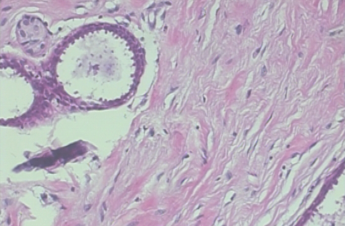</td>
      <td align="center">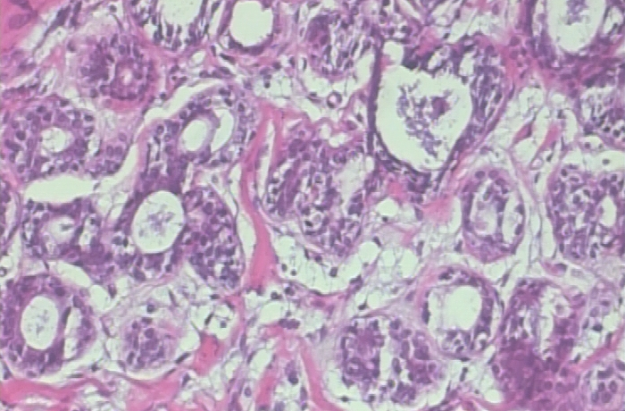</td>
    </tr>
    <tr>
      <td align="center">8</td>
      <td align="center">TA</td>
      <td align="center">Tubular Adenona (benign)</td>
      <td align="center">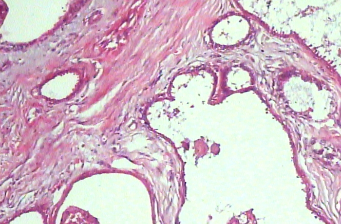</td>
      <td align="center">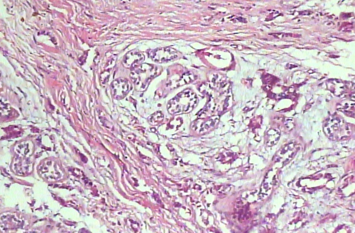</td>
      <td align="center">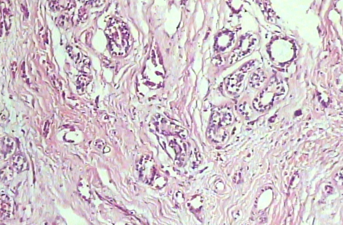</td>
    </tr>
  </tbody>
</table>

All images are extracted from the **[BreakHis dataset](https://web.inf.ufpr.br/vri/databases/breast-cancer-histopathological-database-breakhis/)**. It is used as a benchmark in many medical imaging competition, but often only for binary classification (identifying if a tumor is benign or malignant). Histologically benign is a term referring to a lesion that does not match any criteria of malignancy – e.g., marked cellular atypia, mitosis, disruption of basement membranes, metastasize, etc. Normally, benign tumors are relatively “innocents”, presents slow growing and remains localized. Malignant tumor is a synonym for cancer: lesion can invade and destroy adjacent structures (locally invasive) and spread to distant sites (metastasize) to cause death.  
The samples present in the dataset were collected by SOB method, also named partial mastectomy or excisional biopsy. This type of procedure, compared to any methods of needle biopsy, removes the larger size of tissue sample and is done in a hospital with general anesthetic.

The annoted dataset (Train folder) used in this challenge consists of **422 images** randomly extracted from BreakHis, the number of images to classify (Test folder) contains **207 images**.  
The images are of dimension 700x456 or 700x460 pixels in RGB format.  
The **metric** used to rank the submissions in this datachallenge was the **[F1-score](https://en.wikipedia.org/wiki/F-score)**, which gives equal importance to precision and recall. The accuracy of the submitted classifiers was also displayed, but not used for scoring.

## Key difficulties

Three main difficulties had to be addressed during this datachallenge :
* **Small size of the dataset**  
The state of the art for histopathological image classification is currently composed of methods based on Deep Learning, which require a consequent number of images to train from scratch. The small number of training images made this kind of approach unreasonable, so I instead opted for more traditionnal image classification techniques based on feature extraction and classical machine learning (e.g. SVM, Random Forest, Boosting, Logistic Regression). The small number of images could alos be leveraged by using more computationally intensive but rigorous cross-validation methods, such as **Leave-One-Out**.
* **Class imbalance**  
As can be seen on the following graph, the repartition of images in each class is heavily unbalanced.

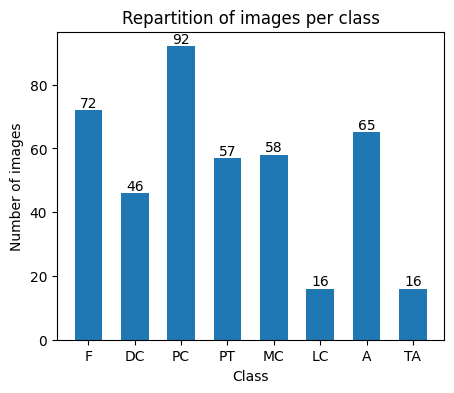

This can bias the model towards more represented classes, and make the learning of general features harder for the least represented classes (LC and TA in this case).

* **Multi-labels images**  
From the images alone, finding the dataset from which they had been extracted was not difficult. However, the annotations for each image are made by experts who have access to more than just the histopathological images, and who know that several images actually come from a single slice, from a single patient - information which is not available on the test set. Finally, several types of tumor may be present in a single image. For all these reasons, many images can actually be classified into several classes. There is an especially high number of such cases for classes **DC** (Carcinoma) and **LC** (Lobular Carcinoma), as can be seen in the following examples where the same image was found in the Train folder, in the Test folder and in the BreakHis dataset with a name different from the Train Folder

| Image | Name in the Test folder | Alias name in the BreakHis dataset | Name in the Train folder | Possible classes |
|:-------------------------:|:-------------------------:|:-------------------------:|:-------------------------:|:-------------------------:|
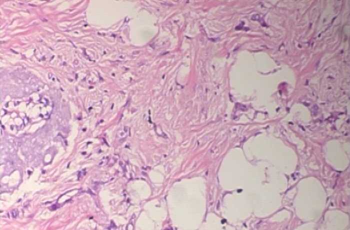  |  SOB_18 | SOB_M_LC-14-13412-100-026  |  [SOB_M_DC-14-13412-100-026](./data-challenge/Train/SOB_M_DC-14-13412-100-026.png) | LC or DC
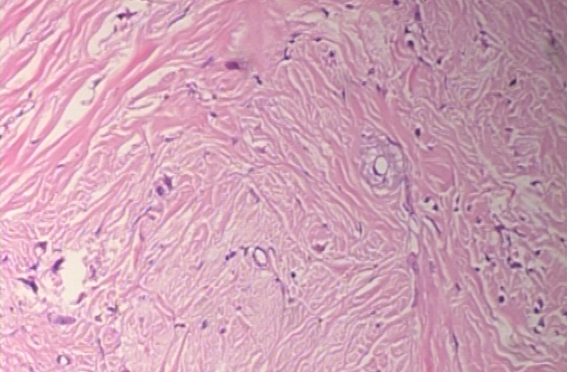  |  SOB_28 | SOB_M_LC-14-13412-100-025  |  [SOB_M_DC-14-13412-100-025](./data-challenge/Train/SOB_M_DC-14-13412-100-025.png) | LC or DC
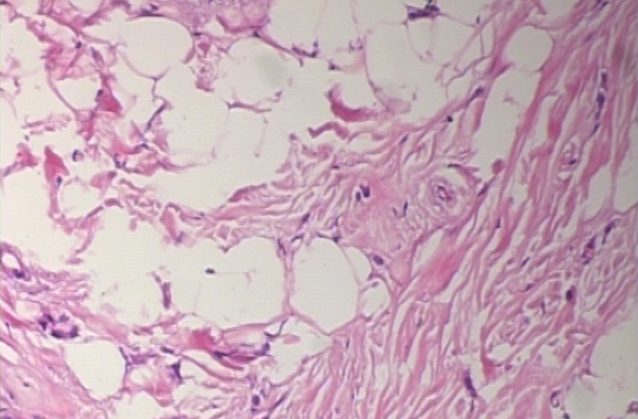  |  SOB_29 | SOB_M_LC-14-13412-100-001  |  [SOB_M_DC-14-13412-100-001](./data-challenge/Train/SOB_M_DC-14-13412-100-001.png) | LC or DC

Even with a perfect classifier, getting a perfect score is thus dependent on luck !

## Results
I obtained my best score with the following classifier :
* **SVM classifier with Tanimoto Kernel** (implementation found [here](https://github.com/gmum/pykernels/blob/master/pykernels/regular.py)), using a regularization parameter C=6
* 7 feature extractors
  * Parameter-Free Threshold Adjacency Statistics (PFTAS)
  * Channel color statistics (mean, standard deviation, skewness, kurtosis)
  * Hu Moments
  * Haralick features
  * 11 bits HSV color histogram
  * Local Binary Patterning (LBP), with a radius of 9 pixels and 72 points
  * SIFT, with a Bag of Words of 300 centroids

The theory behind each feature is explained in the presentation in PDF format, the choice of the parameters for each feature is detailed in the jupyter notebook.  
The combination of these features allowed me to **score 1st amongst 36 participants** in the alloted time, as shown in the screenshot below :
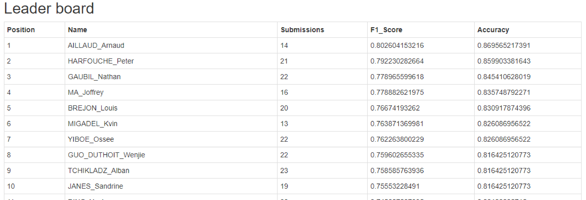

Interestingly, with some efforts, Joffrey MA managed to get a better **F1-score of 0.815458990715** *after the deadline*, by finetuning a Swin model pretrained on Imagenet (weights taken from [Huggingface](https://huggingface.co/microsoft/swin-base-patch4-window7-224-in22k)). A deep learning approach was thus reasonable, but required a pretrained model and considerably more computing ressources.

## References

1. [PFTAS](https://bmcbioinformatics.biomedcentral.com/counter/pdf/10.1186/1471-2105-8-110.pdf) : Nicholas A Hamilton et al. *Fast automated cell phenotype image classification*, BMC Bioinformatics, March 2007
2. [Hu moments](https://ieeexplore.ieee.org/document/1057692) : Ming-Kuei Hu *Visual pattern recognition by moment invariants*, IEEE IRE Transactions on Information Theory, February 1962
3. [Haralick](https://ieeexplore.ieee.org/document/4309314) : Robert M Haralick et al. *Textural Features for Image Classification*, IEEE Transactions On Systems Man And Cybernetics, November 1973
4. [LBP](http://vision.stanford.edu/teaching/cs231b_spring1415/papers/lbp.pdf) : T. Ojala and al. *Multiresolution gray-scale and rotation invariant texture classification with local binary patterns*, IEEE Transactions on Pattern Analysis and Machine Intelligence, July 2002
5. [SIFT](https://www.cs.ubc.ca/~lowe/papers/ijcv04.pdf) : David G. Lowe. *Distinctive Image Features from Scale-Invariant Keypoints*, International Journal of Computer Vision, November 2004
